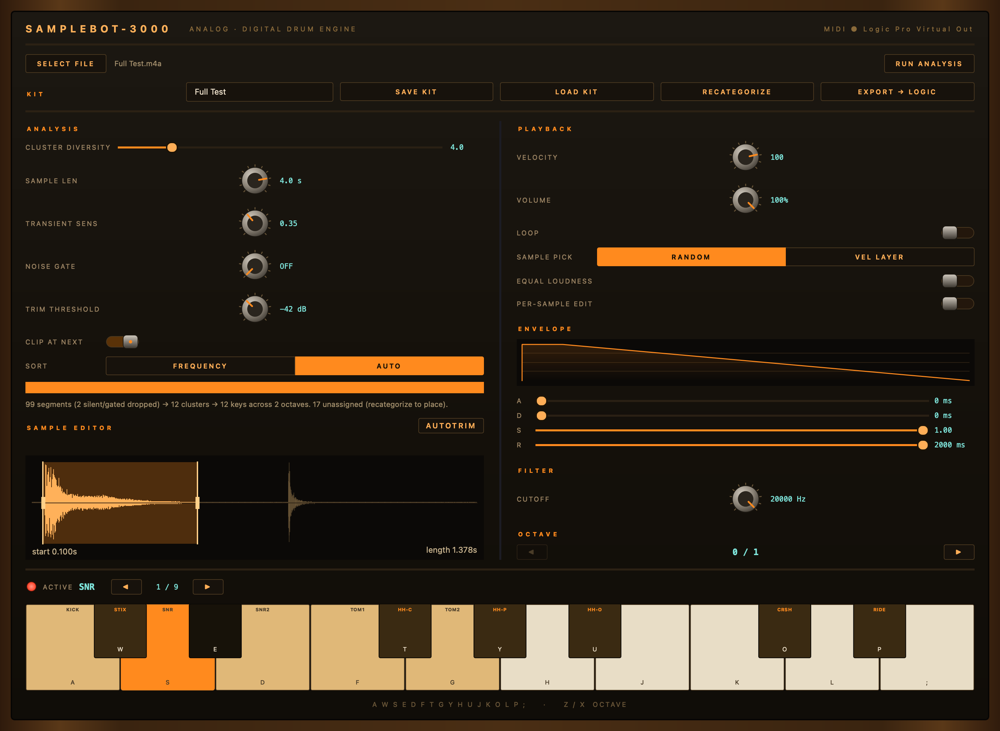

# Samplebot-3000

Turn any audio file into a playable drum kit. Point it at a recording — a drum
loop, a break, a raw kit session — and it finds every transient, slices a sample
from each, groups the slices by timbre, lays them across a keyboard, and lets you
play, trim, and tune them. When you like what you hear, save the kit or export it
to Logic Pro as a native Sampler instrument.



> The Python package and console script are still named `audio2inst` for
> backward compatibility; `samplebot-3000` is the alias.

---

## Install

Requires Python 3.10+ and PortAudio:

```bash
brew install portaudio                                   # macOS
python -m venv .venv && source .venv/bin/activate && pip install -e .
```

The `.venv` must live in the project directory — `main.py` re-execs itself under
it, so the app always runs against the right audio stack whatever interpreter you
launch from.

**Optional (recommended): the CLAP model.** The **AUTO** sorter labels clusters
with a pretrained audio-embedding model. It's an extra because it pulls in torch:

```bash
pip install -e ".[clap]"
```

The checkpoint (`laion/clap-htsat-unfused`, ~600 MB) downloads once on first use
and is cached. Without it the app runs fine — you just won't get AUTO sorting.

## Run

```bash
python main.py
```

If no audio device opens, the GUI still launches and runs silent, so you can
analyze without sound.

---

## Quick start

1. **SELECT FILE** → pick a wav, aif(f), flac, mp3, ogg or m4a.
2. Choose a **SORT** mode: **AUTO** (drops each cluster on its General-MIDI drum
   key) or **FREQUENCY** (orders clusters by pitch across the keyboard).
3. **RUN ANALYSIS**. The status line reports what happened — segments found,
   clusters formed, keys filled, and anything left unassigned.
4. Play it: computer keys `A W S E D F T G Y H U J K O L P ;`, `Z` / `X` to
   change octave, or a USB MIDI keyboard.
5. Tidy up: **SAMPLE EDITOR** / **AUTOTRIM** to tighten slices, **RECATEGORIZE**
   to fix any misplaced sample.
6. **SAVE KIT**, or **EXPORT → LOGIC**.

---

## The panel

### ANALYSIS (left)

These shape the slicing and grouping. All of them need a **RUN ANALYSIS** to take
effect (except **SORT**, see below).

| Control | Default | What it does |
|---|---|---|
| **CLUSTER DIVERSITY** | 4.0 | HDBSCAN's minimum cluster size. Lower = more, smaller, pickier groups; higher = fewer, broader ones. The fractional part feeds a cluster-merge epsilon. |
| **SAMPLE LEN** | 4.0 s | Maximum length of the sample that gets **played and exported**. It does *not* affect grouping — sorting always runs on a fixed short internal window, so a long ring-out can't skew it. |
| **TRANSIENT SENS** | 0.35 | Onset-detector sensitivity. Higher catches more (and subtler) hits; lower keeps only strong ones. |
| **NOISE GATE** | OFF | Drops any slice whose peak never rises above this level. |
| **TRIM THRESHOLD** | −42 dB | Where a slice's tail ends — it runs until the envelope decays below this. |
| **CLIP AT NEXT** | on | Also end a slice as soon as the next transient arrives, so hits never bleed into each other. |

Onsets closer than 100 ms apart are rejected, and near-identical slices are
deduped automatically.

### SORT — FREQUENCY | AUTO

How finished clusters land on keys.

- **FREQUENCY** — clusters ordered by pitch, low to high, one per key. No labels,
  no assumptions. Toggling to it **re-sorts live**, no re-run needed.
- **AUTO** — each cluster is embedded with CLAP, matched against per-drum prompt
  ensembles, pitch-corrected (kick↔tom confusion, and toms resolved to low/mid/high
  *relative to this kit*), then placed on its General-MIDI drum key, one cluster
  per key. Needs a fresh **RUN ANALYSIS** to label clusters.

AUTO types each cluster *as a whole*, by consensus, so a few odd slices can't flip
a group's label.

The GM layout is standard, starting at C1 (MIDI 36):

```
C1  KICK   C#1 STIX   D1  SNR    D#1 CLAP   E1  SNR2   F1  TOM1
F#1 HH-C   G1  TOM2   G#1 HH-P   A1  TOM3   A#1 HH-O   B1  TOM4
C2  TOM5   C#2 CRSH   D2  TOM6   D#2 RIDE   E2  CHINA  F2  BELL
F#2 TAMB   G2  SPLSH  G#2 COW    A2  CRSH2  A#2 FX     B2  RIDE2
```

A family with several keys (toms, hats, cymbals) spreads across them by an
acoustic cue — toms by pitch, hats by openness, cymbals by brightness.

### SAMPLE EDITOR + AUTOTRIM

Press a key (or tab with **◀ ▶**) to load the active sample. The editor shows its
**padded source** — 0.1 s of runway before the onset, 2.5 s after the tail — with
the kept region highlighted. Drag either end to retrim the start or elongate the
tail. Edits change what plays **and** what exports.

**AUTOTRIM** does it in bulk:

1. Click **AUTOTRIM** to arm it. **TRANSIENT SENS** and **TRIM THRESHOLD** light
   up blue — they now drive the trim, not the next analysis.
2. Dial them; the editor previews the cut on the current sample live.
3. **APPLY TO CLUSTER** commits that trim to every sample on the **selected key**.

It's per-cluster on purpose: kicks and hats want different trims, so you judge one
cluster, apply, then move to the next.

### PLAYBACK (right)

| Control | Default | What it does |
|---|---|---|
| **VELOCITY** | 100 | Hit loudness, plus a slight velocity-dependent lowpass so soft hits sit darker. In VEL LAYER mode it also picks the layer. |
| **VOLUME** | 100% | A stored level trim on the sample, separate from live velocity. |
| **LOOP** | off | Loops the sample while the key is held. |
| **SAMPLE PICK** | RANDOM | How a key with several stacked samples chooses one per hit. **RANDOM** = a different sample each time (round-robin feel). **VEL LAYER** = the velocity picks it, soft → loud. |
| **EQUAL LOUDNESS** | off | A-weighted perceived-loudness normalization. Peak-normalized samples aren't *perceived* equally loud — this tames the bright, harsh ones down so the kit sits even. Pure gain, no EQ. Applies to playback and the export. |
| **PER-SAMPLE EDIT** | off | Off, **VOLUME / ENVELOPE / FILTER** edits apply to the whole cluster on the selected key. On, they sculpt only the active sample. |

**ENVELOPE** is a per-voice ADSR (default `0 ms / 0 ms / 1.00 / 2000 ms`, so
samples ring out). **FILTER** is a per-voice lowpass, set by its **CUTOFF**
knob (20 Hz – 20 kHz, log, open by default).
**OCTAVE** (`◀ ▶`, or `Z` / `X`) moves the 17 visible keys across the full layout.

Each voice captures its own envelope and cutoff at play time, so per-sample
settings never bleed across overlapping voices.

### Keyboard and MIDI

Computer keys map to the visible octave:

```
 black:   W  E     T  Y  U     O  P
 white:  A  S  D  F  G  H  J  K  L  ;
```

A USB MIDI keyboard is picked up automatically — the header shows the connected
port, and plugging or unplugging is detected while running. MIDI note 36 is key 0
(KICK), matching the GM map, and real per-hit velocity drives gain, the darkening
lowpass, and VEL LAYER selection.

---

## Kits

### SAVE KIT / LOAD KIT

Type a name and **SAVE KIT** to snapshot the whole instrument to
`kits/<KitName>/` — a `kit.json` manifest plus one lossless float32 WAV per
sample, including each sample's playback settings, labels, and editor bounds.
**LOAD KIT** brings it back ready to audition, recategorize, and export.

### RECATEGORIZE

Opens one flat list of every sample, grouped under a header per key.

- **Drag** a sample (or a shift/ctrl-selected bunch, even across clusters) under
  another header to reassign it; drop it under **✕ REMOVE** to drop it from the kit.
- **Click** a sample to audition it.
- To move a **whole cluster** to a different key, hit its header's **Assign to
  Key** button, then press the computer key you want it on (same piano layout,
  `Z`/`X` for octave). Landing on an occupied key **swaps** the two clusters.

Slices the clusterer couldn't place land in an *unassigned* pile — recategorize is
where you place them.

### EXPORT → LOGIC

Writes a native Logic Pro **EXS24 ("Sampler") instrument**: a folder of WAVs plus
a `.exs` that maps each sample to its MIDI key. It defaults into
`~/Music/Audio Music Apps/Sampler Instruments/Samplebot-3000/`, so every kit shows
up grouped under Logic's Sampler instrument menu and plays natively — no Samplebot
window needed.

The export mirrors how the kit sounds in the app:

- **SAMPLE PICK** carries over — **RANDOM** becomes true round-robin groups,
  **VEL LAYER** becomes a velocity split.
- **Hi-hat keys (F#1 / G#1 / A#1) get a real choke** — exclusive class 1, mono
  voices, so closed and pedal hats cut the open hat's ring.
- **VOLUME, FILTER, ENVELOPE** and equal-loudness are baked into the exported
  WAVs. Velocity stays live, so the kit still responds to how hard you play.

The EXS writer clones a Logic-authored reference instrument byte-for-byte and
patches only the per-instance fields, which is why the round-robin and choke
behavior survives the trip.

---

## How it works

```
audio file
  → detect transients (librosa), reject onsets < 100 ms apart
  → per transient: capture from the onset until the tail decays below TRIM
    THRESHOLD, or SAMPLE LEN is hit, or the next onset arrives (CLIP AT NEXT)
  → gate, trim, peak-normalize, dedup near-identical slices
  → STAGE 1  cluster with HDBSCAN on 57-dim hand-crafted features
  → STAGE 2  (AUTO only) CLAP-label each cluster and place it on its GM key
```

Clustering is deliberately stage 1 and label-free: grouping this kit's own sounds
is a job the audio features already do well, and CLAP is applied afterward only to
*name* the groups. HDBSCAN is the only clusterer — KMeans and Agglomerative
assume shapes that audio features don't have, and were removed. (KMeans survives
as HDBSCAN's internal fallback for the rare input with no density structure.)

**Feature windows are decoupled from SAMPLE LEN.** Clustering uses a fixed 0.7 s
window, CLAP-labelling a fixed 0.5 s one. The slider only sets how much audio is
played and exported, so lengthening a ring-out can never drag the sorting
out-of-distribution.

**Features.** The 57-dim vector is 13 MFCC means + 13 MFCC stds + 13 MFCC-delta
means + 12 chroma + spectral centroid (mean/std), rolloff, bandwidth, flatness and
zero-crossing rate, computed on a peak-normalized copy so loudness doesn't leak in.
There is exactly one audio→features implementation
(`pipeline.segment_features` / `features_from_oneshot`), shared by training and
serving; `tests/test_train_serve_skew.py` locks that in.

---

## Repo map

```
main.py                  re-exec into .venv, then launch
gui.py                   main window: controls, keyboard, kit actions
pipeline.py              slicing, features, clustering, CLAP sort, GM layout
embedders.py             pluggable pretrained embedders (CLAP backend)
audio_engine.py          output stream; per-voice ADSR + lowpass
waveform_editor.py       per-sample trim / elongate view
recategorize_dialog.py   drag-and-drop sample reassignment
kit_store.py             save / load kits under kits/
logic_export.py          EXS24 writer: zones, groups, round-robin, choke
exs_templates.py         verbatim EXS24 blocks cloned from Logic's own file
midi_input.py            USB MIDI in
loudness.py              A-weighted equal-loudness gains
piano_widget.py          keyboard painting + selection
moog_widgets.py          Knob, ToggleSwitch, LED
adsr_widget.py           envelope curve
```

Each test file runs standalone: `python tests/test_train_serve_skew.py`
(likewise `test_logic_export.py`, `test_hybrid_classifier.py`).

### Offline tooling

Not needed to run the app — these train and honestly evaluate the models behind
the research line. Evaluation is **leave-one-machine-out** (grouped by source drum
machine, so siblings from one kit can't leak across the split); macro-F1 under
LOMO is the metric throughout.

```bash
python classifier.py --train --model clap    # train a supervised drum-type model
python train_hybrid.py --domain acoustic     # cascade/flat hybrid (--domain required)
python autosort_bakeoff.py --domain acoustic # which features predict drum family
python model_analysis.py                     # LOMO + random-vs-grouped gap
python embed_eval.py --backend clap          # LOMO for CLAP embeddings
python acoustic_eval.py transfer             # synth → acoustic generalization
python fx_reject.py --method calibrated      # FX as open-set rejection
```

Data helpers: `logic_import.py` (mine Logic's stock kits and your saved kits for
training data), `datasets_loader.py`, `sort_samples.py`, `normalize_names.py`.

These scripts load `models/*.joblib`; the app itself never does. `models/rf.joblib`
(34 MB, superseded) is untracked — rebuild it with
`python classifier.py --train --model rf`. Background on this line, including the
evaluation methodology, is archived in
[`docs/CLASSIFIER_IMPROVEMENT_BRIEF.md`](docs/CLASSIFIER_IMPROVEMENT_BRIEF.md).

---

## Notes and limits

- **AUTO needs CLAP.** Without the optional extra, use FREQUENCY and place
  clusters yourself in RECATEGORIZE.
- **Unassigned slices are normal.** HDBSCAN marks genuine outliers rather than
  forcing them into a group; RECATEGORIZE is where you triage them.
- **Toms and FX are the weak spots.** Honest LOMO evaluation shows kick/snare/hat
  generalizing well even synth→acoustic (~0.97 macro-F1); pitch-based tom splits
  and FX taxonomy are what still need work.
- **Choke groups are export-only for now** — a closed hat cuts an open one in the
  exported Logic kit, but not yet when you play inside Samplebot (see Roadmap).
- **Loops have no crossfade** at the seam — capture a longer slice or use a long
  release to hide the click.
- **Memory scales with sample length** — a 5 s slice at 44.1 kHz mono is ~882 KB.

## Roadmap

- **Per-key gating (choke / mute groups) in the app.** Keys sharing a group cut
  each other off, so a closed hi-hat silences a ringing open hi-hat the way a real
  kit does — the same behavior the Logic export already writes, brought into live
  playback. The audio engine and EXS hooks are in place; it's gated on reliable
  open/closed hat labelling.
- **Pitch control.** A pitch knob beside the filter that transposes a sample
  independently per key (resample / phase-vocoder), so one slice can be tuned
  across the keyboard — melodic toms, tuned percussion, bass hits.
- **Learning from your corrections** — treat every RECATEGORIZE move as a labeled
  example and recalibrate on your own taste.
- **More embedding backends** (PaSST / BEATs / OpenL3) behind the same interface,
  chosen by LOMO macro-F1.
- **A headless / Raspberry Pi build** — `midi_input.py` is already frontend-agnostic
  groundwork for it.
