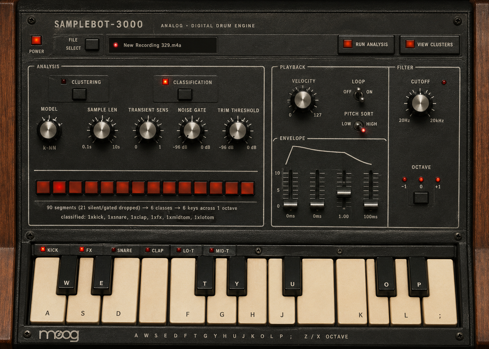

# Samplebot-3000

Turn any audio file into a playable drum-machine instrument. Point it at a
recording — a drum loop, a break, a field recording — and it detects every
transient, slices a sample from each, fingerprints it by timbre, and lays the
samples out on a keyboard. Two ways to organize them:

- **Clustering** (unsupervised) — groups acoustically similar slices and maps
  each group to a key. Three algorithms: KMeans, Agglomerative, HDBSCAN.
- **Classification** (supervised) — a trained model labels each slice as a drum
  type (kick, snare, hat, tom, clap, fx, …) and places it on a fixed
  General-MIDI-style drum layout. Five models to choose from.

Pick a wav/mp3/flac/aiff, choose Clustering or Classification, hit **Run**, and
play it with your computer keyboard. Each key holds a set of samples you tab
through with arrows, and every sample carries its own envelope, velocity,
loop, and filter settings. A 16-step sequencer grid is wired for a coming
step-sequencer mode.



> The console script and Python package are still named `audio2inst` for
> backward compatibility; `samplebot-3000` is the alias.

## Install

Requires Python 3.10+. On macOS you also need PortAudio:

```bash
brew install portaudio
```

Then from the project directory:

```bash
python -m venv .venv && source .venv/bin/activate && pip install -e .
```

The app expects its dependencies (PySide6, librosa, scikit-learn, sounddevice,
scipy) in a `.venv` in the project directory.

## Run

```bash
python main.py
```

`main.py` **re-execs itself under the project `.venv`** if launched from another
interpreter (e.g. a conda `base` env), so it always runs against the right audio
stack and library versions. If no audio device can be opened the GUI still
launches — it just runs silent so you can analyze without sound.

## Controls

### Method toggle

A segmented switch picks **CLUSTERING** or **CLASSIFICATION** — never both. The
data-cleaning pipeline (transient detection, gate, trim, normalize) is identical
for both; only the grouping step differs.

- **CLUSTERING** → a **MODE** dropdown (KMeans / Agglomerative / HDBSCAN) and its
  parameter. Each cluster becomes a key; no instrument labels.
- **CLASSIFICATION** → a **MODEL** dropdown (SVM / Random Forest / k-NN /
  Gradient Boost / Neural Net). Each slice is labeled and placed on the fixed
  drum layout below.

### Analysis (left column)

- **Sample Len** (0.1–5.0 s) — the maximum sample length captured from each
  transient. Default 0.5s suits drums; raise it for sustained material.
- **Transient Sens** — onset-detector sensitivity. Higher catches more (subtler)
  transients; lower keeps only strong hits.
- **Noise Gate** — a transient whose peak never rises above this level is
  dropped entirely.
- **Trim Threshold** — where a sample's tail ends: the sample runs from the
  transient until its envelope decays below this level.
- **Clip at Next** — when on, a sample also ends as soon as the next transient is
  detected; when off it runs to the trim-threshold decay or the sample-length
  cap, whichever comes first.
- **Run Analysis** / **View Clusters** — the pipeline runs on a worker thread;
  the cluster viewer opens after a run to audition every slice.
- **Sequencer · 16 steps** — a clickable grid. Select a key, then light up the
  steps where it should trigger. Patterns are stored per key. (Playback clock is
  not wired yet — this is state for the coming step-sequencer mode.)

### Playback — per sample (right column)

Pressing a key **selects** it (amber outline + the ACTIVE light shows its name).
The **◀ N / M ▶** selector tabs through that key's samples; the chosen sample is
what plays. **Every playback control below applies to the currently selected
sample** and is remembered per sample:

- **Velocity** (1–127) — output volume plus a slight velocity-dependent lowpass
  (softer hits are a touch darker).
- **Loop** — loops the sample while the key is held.
- **Envelope (ADSR)** — per-voice attack / decay / sustain / release.
- **Filter** — per-voice lowpass cutoff (20 Hz – 20 kHz, log).
- **Pitch Sort** / **Octave** — clustering-mode global controls (ordering and
  multi-octave reach); not used by the fixed classification layout.

### Keyboard

Computer keys `A W S E D F T G Y H U J K O L P ;` map to the visible octave.

In **classification** mode the layout is a fixed drum kit:

```
key:  C   C#   D   D#   E    F   F#   G   G#   A   A#   B   C   C#   D    D#   E
       Kick Snr1 Snr2 Clap Snr3 LoT HH1 MidT HH2 HiT HH3 FX1 FX2 Crash FX3 Ride FX4
```

Drum types with several keys (snare, hats, fx) spread their samples round-robin
across those keys.

## Data pipeline

```
raw file
  → detect transients above the noise gate
  → for each: grab from the transient start until the signal falls below the
    trim threshold, OR hits the sample-length cap, OR the next transient
    (only if "Clip at Next" is on)
  → normalize each sample (peak)
  → cluster (KMeans/Agglomerative/HDBSCAN)  OR  classify (trained model)
```

### Feature vector (57 dims)

Each slice is reduced to a 57-number timbre fingerprint, used by both clustering
and the classifier: 13 MFCC means + 13 MFCC stds + 13 MFCC-delta means + 12
chroma + spectral centroid (mean/std), rolloff, bandwidth, flatness, and
zero-crossing rate. Features are computed on a peak-normalized copy so loudness
doesn't influence them.

## Supervised classifier

`classifier.py` trains/evaluates the drum-type models from the sorted
`training data/` bins (kept out of the repo). The five models are saved to
`models/*.joblib` and selected live in the GUI.

```bash
python classifier.py --extract            # build feature_cache.npz from the bins
python classifier.py --compare            # 5-fold CV accuracy for all models
python classifier.py --train --model gb   # train + save one model
python classifier.py --predict file.wav --model gb
```

`model_analysis.py` runs an honest evaluation grouped by source drum machine
(leave-one-machine-out) to expose train/serve skew and per-class weaknesses.

Supporting data tools (operate on `training data/`, not needed to run the app):
`sort_samples.py` (name-based bin sorter), `normalize_names.py` (rename/repack
bins).

## Architecture

```
main.py                    (re-exec into .venv, then launch)
  └─ gui.py
       ├─ pipeline.py        (worker QThread — extract, cluster/classify, build)
       ├─ audio_engine.py    (OutputStream; per-voice ADSR + per-voice lowpass)
       ├─ piano_widget.py    (paints the octave; selection + key labels)
       ├─ moog_widgets.py    (Knob, ToggleSwitch, LED, StepGrid)
       ├─ cluster_viewer.py  (dialog: audition every slice in every key)
       ├─ adsr_widget.py     (envelope curve visualizer)
       └─ classifier.py      (load trained models for classification mode)
```

- **pipeline.py** — `run_pipeline(path, mode, …, classifier_model, clip_at_next_onset)`
  → `Instrument`. Transient detect (librosa) → gate/trim/normalize → 57-dim
  features → cluster or classify → key assignment.
- **audio_engine.py** — one OutputStream. Each voice captures its own ADSR and
  lowpass cutoff at play time and is filtered independently, so per-sample
  settings don't bleed across overlapping voices.
- **gui.py** — per-sample `PlaybackSettings` are stored on each slice; selecting
  a sample loads its settings into the controls, editing a control writes back,
  and playing applies them.

## Roadmap / Future work

- **Step sequencer playback.** The 16-step grid stores a pattern per key; next
  is a transport/clock that triggers each key on its lit steps.
- **Model tuning.** Improve classification: align training feature extraction
  with the live pipeline's segmentation, add a pitch feature to separate
  hi/mid/lo toms, and reconsider the catch-all `fx` class.
- **Logic Pro / Sampler (EXS24) and SFZ export.** Serialize the built instrument
  (per key: ordered slices + mapping) to native sampler formats so it plays in a
  DAW without the Samplebot window.
- **Plugin wrapper (AU/VST).** Longer term, ship the engine as an instrument
  plugin.

## Notes

- **Velocity no longer selects the sample.** Sample choice is the arrow-tab
  selector; velocity is volume + slight lowpass.
- **Per-sample settings live on the slice**, so they survive pitch-sort
  re-ordering in clustering mode.
- **Loops are naive** (no crossfade at the seam) — capture a longer slice or use
  a long release to hide the click.
- **Memory scales with sample length** — a 5 s slice at 44.1 kHz mono is ~882 KB.
